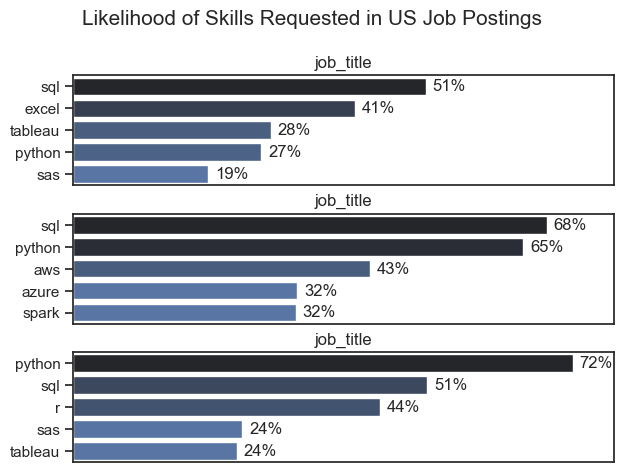
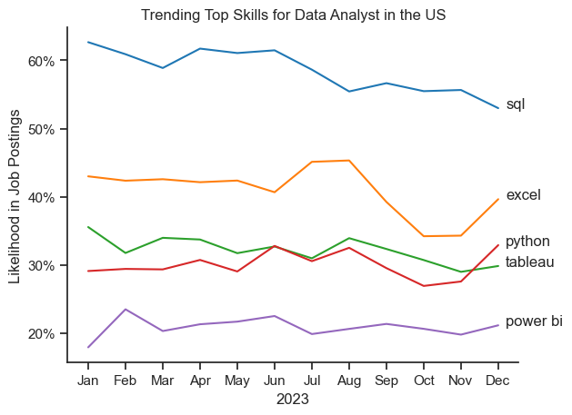
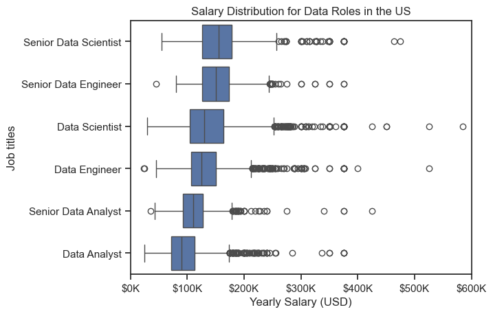
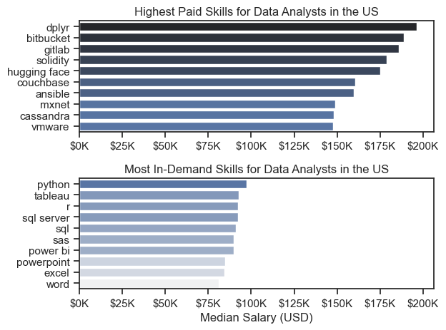

# The Analysis

## 1. What are the most demanded skills for the top 3 most popular data roles?

To find the most demanded skills for the top 3 most popular data roles, I filtered out those positions by which ones were the most popular, and got the top 5 skills for these top 3 roles. This query highlights the most popular job titles and their top skills, showing which skills I should pay attention to depending on the roles I'm targeting. 

View my notebook with detailed steps here:

[2_Skills_Count.ipynb](3_Project/2_Skills_Count.ipynb)

### Visualise Data

```python 
#plotting the graph - need only 1 column
fig, ax = plt.subplots(len(job_titles), 1)

sns.set_theme(style = 'ticks')

#We need to loop in the list
for i, job_title in enumerate(job_titles):
    df_plot = df_skills_perc[df_skills_perc['job_title_short']==job_title].head(5)
    #df_plot.plot(kind = 'barh', x = 'job_skills', y = 'skill_perc', ax=ax[i], title = job_title)
    #Change for seaborn plot instead
    sns.barplot(data = df_plot, x='skill_perc', y='job_skills', ax=ax[i], hue ='skill_count', palette = 'dark:b_r')
    #clean up the graph
    ax[i].set_title('job_title')
    ax[i].set_ylabel('')
    ax[i].set_xlabel('')
    ax[i].legend().remove()
    ax[i].set_xlim(0, 78)

    #To add number of percentage to the plot, we need to loop through the df_plot to get the number
    for n, v in enumerate (df_plot['skill_perc']):
        # v +1 means add space to the number
        # v = 'center' means vertical number at the center
        ax[i].text(v + 1, n, f'{v:.0f}%', va = 'center')

    # Remove all the x ticks but keep the ticks of the last plot
    if i != len('job_titles') - 1:
        ax[i].set_xticks([])

    fig.suptitle('Likelihood of Skills Requested in US Job Postings', fontsize=15)
    #Fix the overlap
    fig.tight_layout(h_pad = 0.5)
    
plt.show()
```

### Results



### Insights
- SQL is highly in demand, appearing in all three groups and reaching 68% in the second group.
- Python is also a core skill, ranging from 27% to 72% and ranking #1 in the third group.
- Excel remains important, with 41% of postings in the first group.
- R is moderately requested, at 44% in the third group.
- Cloud skills are increasingly relevant: AWS (43%), Azure (32%), and Spark (32%) appear in the second group.
- Tableau is consistently useful, appearing at 24–28% across groups.
- SAS appears less frequently, ranging from 19% to 24%.

Overall: SQL + Python appear to be the strongest foundational combination, while cloud, R, Excel, and visualization tools add complementary value.

## 2. How are in demand skills trending for Data Analysts?

### Visualise data

```python

from matplotlib.ticker import PercentFormatter 

df_plot = df_DA_US_percent.iloc[:, :5]
sns.lineplot(data = df_plot, dashes = False, palette = 'tab10')

ax = plt.gca()
ax.yaxis.set_major_formatter(PercentFormatter(decimals=0))

plt.show()


```

### Results


*Bar Graph visualizing the trending top skills for Data Analysts in the US in 2023.*

### Insights
- SQL is the most consistently requested skill, staying around 56–63% for most of the year and ending at 53% in December.
- Excel ranks second overall, fluctuating considerably from 41% to 45% and ending at 40%.
- Python shows moderate demand but finishes strongly, rising from 29% in January to 33% in December.
- Tableau remains relatively stable, generally between 29–35%, but declines to 30% by December.
- Power BI has the lowest demand among these five skills, staying around 18–23% throughout the year.
- The biggest month-to-month changes occur in Excel, particularly the rise from 41% in June to 45% in July followed by a decline to 34% in October.
- Overall pattern: SQL is the dominant skill, while Python, Excel, Tableau, and Power BI form a secondary group of commonly requested data-analyst skills.

# The Analysis

## 3. How well do job and skills pay for data analysts?

### Salary Analysis for Data Nerds

#### Visualize data

```python
# Create horizontal box plot
sns.boxplot(
    data=df_US_top6,
    x='salary_year_avg',
    y='job_title_short',
    order = job_order
)
sns.set_theme(style = 'ticks')

#set x-axis limit
plt.xlim(0, 600000)

# Format x-axis as $100K
tick_x = plt.FuncFormatter(lambda x, pos: f'${x/1000:.0f}K')
plt.gca().xaxis.set_major_formatter(tick_x)
    
plt.title('Salary Distribution for Data Roles in the US')
plt.xlabel('Yearly Salary (USD)')
plt.ylabel('Job titles')
plt.show()

```

#### Results
 *Box Plot Visualizing the salary distributions for the top 6 data job titles.*

#### Insights
- Senior roles generally command higher salaries, with Senior Data Scientist and Senior Data Engineer having medians around $150K.
- Data Analyst has the lowest median (~$95–100K), while Senior Data Analyst is slightly higher at around $110K.
- Data Scientist and Data Engineer show wider salary ranges, with many high-paying outliers above $200K.
- Overall: Salary tends to increase with seniority, but there is substantial overlap and variation within each role.

# The Analysis

### Highest Pay & Most Demanded Skills for Data Analysts

#### Visualize data

```python
# Plot horizental bar graphs - 2 subplots
fig, ax = plt.subplots(2, 1)  

# Top 10 Highest Paid Skills for Data Analysts
sns.barplot(data=df_DA_top_pay, x='median', y=df_DA_top_pay.index, hue='median', ax=ax[0], palette='dark:b_r')
ax[0].legend().remove()
# original code:
# df_DA_top_pay[::-1].plot(kind='barh', y='median', ax=ax[0], legend=False) 
ax[0].set_title('Highest Paid Skills for Data Analysts in the US')
ax[0].set_ylabel('')
ax[0].set_xlabel('')
ax[0].xaxis.set_major_formatter(plt.FuncFormatter(lambda x, _: f'${int(x/1000)}K'))


# Top 10 Most In-Demand Skills for Data Analysts')
sns.barplot(data=df_DA_skills, x='median', y=df_DA_skills.index, hue='median', ax=ax[1], palette='light:b')
ax[1].legend().remove()
# original code:
# df_DA_skills[::-1].plot(kind='barh', y='median', ax=ax[1], legend=False)
ax[1].set_title('Most In-Demand Skills for Data Analysts in the US')
ax[1].set_ylabel('')
ax[1].set_xlabel('Median Salary (USD)')
ax[1].set_xlim(ax[0].get_xlim())  # Set the same x-axis limits as the first plot
ax[1].xaxis.set_major_formatter(plt.FuncFormatter(lambda x, _: f'${int(x/1000)}K'))

sns.set_theme(style='ticks')
plt.tight_layout()
plt.show()

```

#### Results

*Two separate bar graphs visualizing the highest paid skills and most in-demand skills for Data analysts in the US.*

#### Insight
- Highest-paid skills: Dplyr, Bitbucket, GitLab, Solidity, and Hugging Face have the highest median salaries, generally around $170K–$195K.
- Most in-demand skills: Python, Tableau, R, SQL Server, and SQL are among the most frequently requested skills.
- There is a clear trade-off: some specialised skills command higher salaries but appear less frequently, while common skills such as Python and SQL are more broadly demanded.
- For a Data Analyst career, Python + SQL provide strong foundational coverage, while specialised tools such as cloud, Git, or AI/ML technologies could potentially add higher-value skills.


